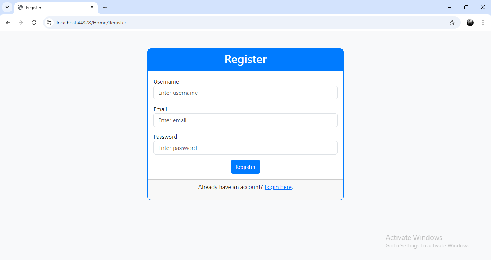
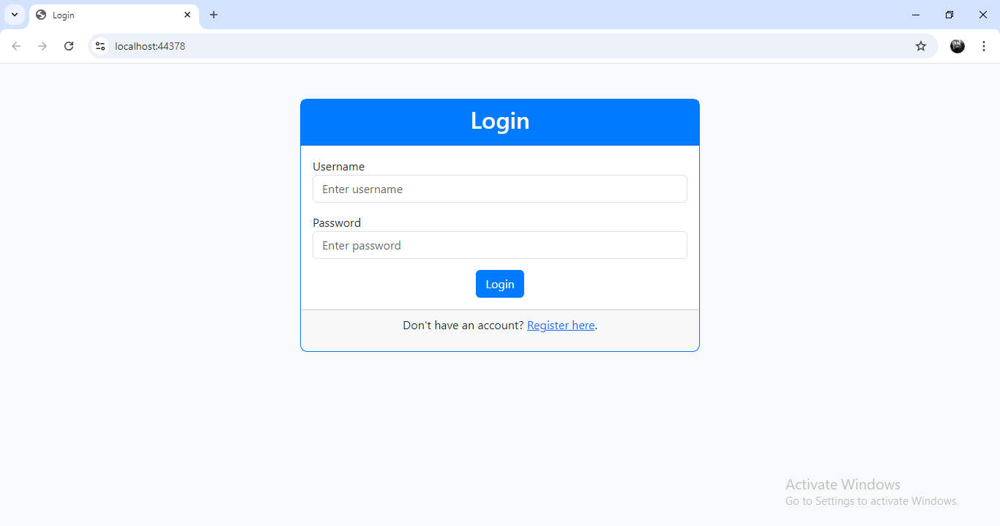
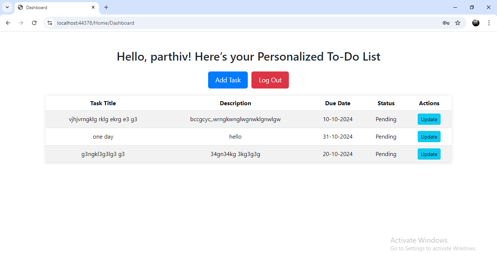
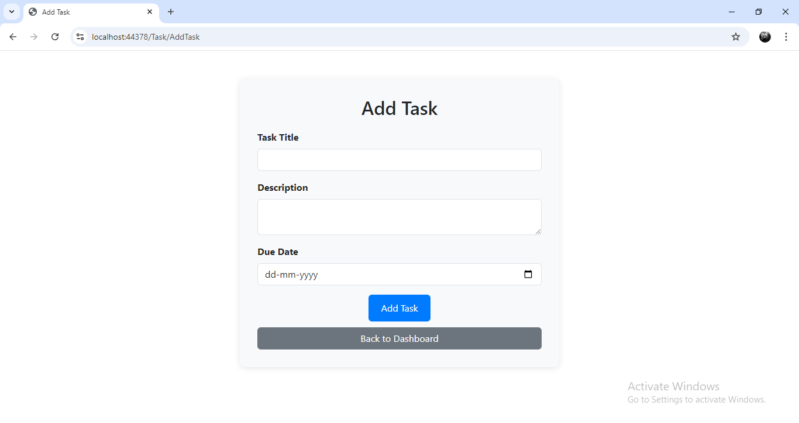
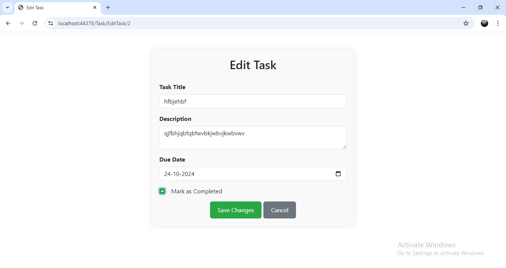
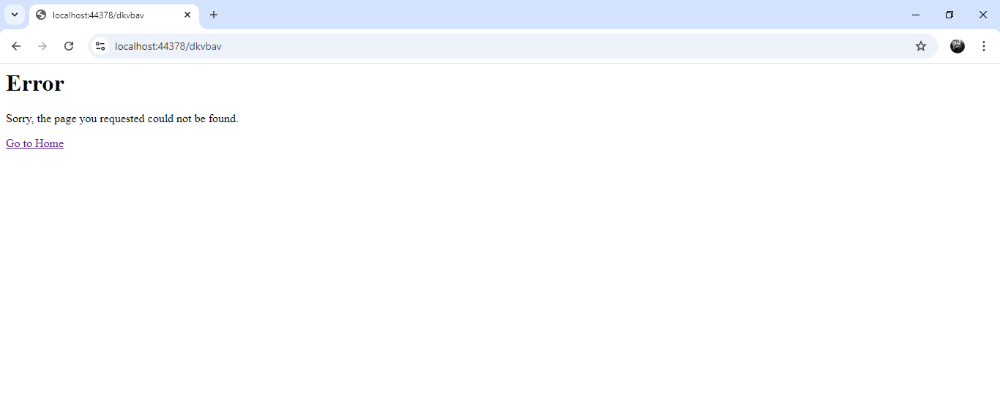

# Todo List Project

## Description
A simple and user-friendly Todo List application that allows users to manage their tasks effectively. Users can add, edit, delete, and mark tasks as complete. The application is built using ASP.NET MVC and follows best practices for web development.

## Features
- User authentication and authorization
- Add, edit, and delete tasks
- Mark tasks as complete
- Responsive design for mobile and desktop users
- Exception Handling

## Technologies Used
- **Front-end:** HTML, CSS, Bootstrape
- **Back-end:** ASP.NET MVC
- **Database:** SQL Server
- **Version Control:** Git and GitHub

## Getting Started

### Prerequisites
- [.NET SDK](https://dotnet.microsoft.com/download) (version 3.1 or later)
- [SQL Server](https://www.microsoft.com/en-us/sql-server/sql-server-downloads) (Express version is sufficient)
- [Visual Studio](https://visualstudio.microsoft.com/) (or any preferred IDE)

### Installation
1. Clone the repository:
   ```bash
   git clone https://github.com/Parthiv-03/TodolistProject.git
2. Update Connection String:
   ```bash
   "ConnectionStrings": {"DefaultConnection": "Server=YOUR_SERVER;Database=YOUR_DATABASE;User Id=YOUR_USERNAME;Password=YOUR_PASSWORD;"}
4. Install Entity Framework Core Tools:
   ```bash
   Install-Package Microsoft.EntityFrameworkCore.Tools
6. Run Database Migrations
   ```bash
   Update-Database

## Screenshots


### Register Page
The register page allows new users to sign up.



### Login Page
The login page requires users to authenticate with their credentials.



### Homepage
This is the homepage of the Todo List application where users can view their tasks.



### Add Task Page
Users can add a new task through this page.



### Edit Page
The edit page allows users to modify their existing tasks.



### Error Page
Users use incorrect url this error comes.




